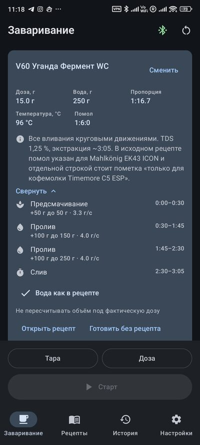
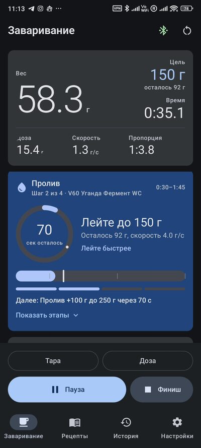
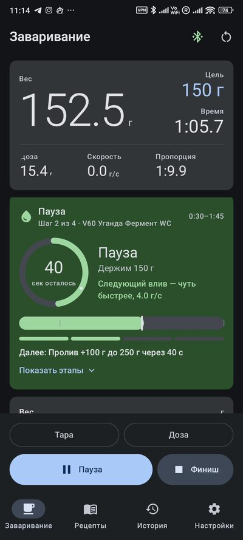
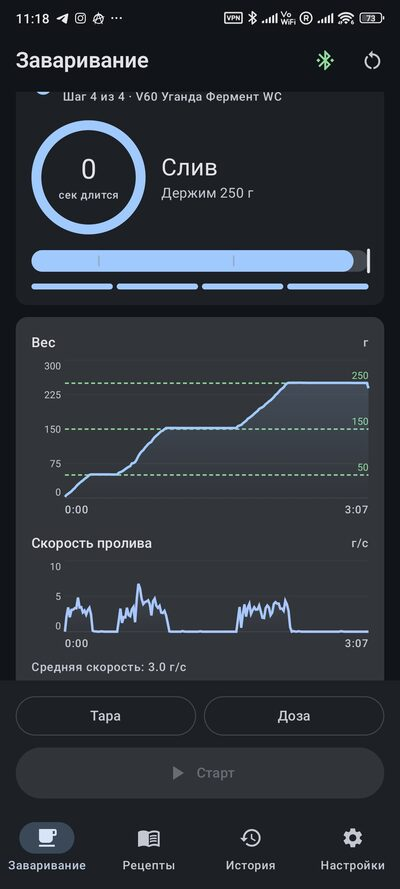
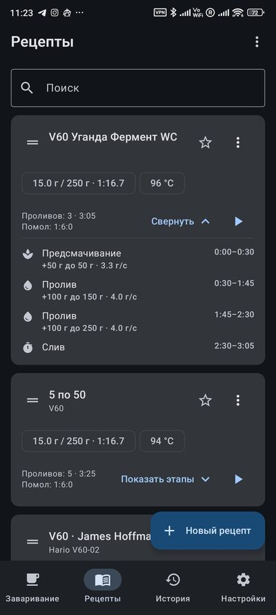
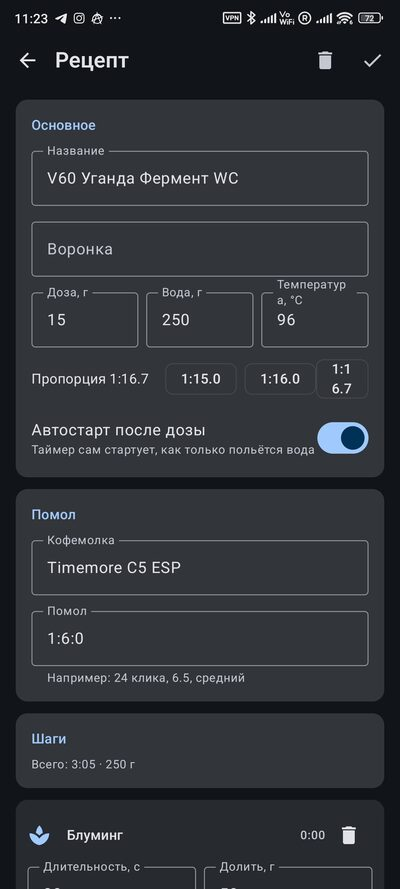

# Pourista

[](https://github.com/DrSkyFly/Pourista/actions/workflows/build.yml)
[](LICENSE)

An Android app for brewing coffee to a recipe: it walks you through the steps —
when to pour, how much, and how fast.

Scales are optional. Without them it is a recipe book with a step-by-step timer
that knows when to pour, when to wait and how much to add. With a
**Futula Kitchen Scale 3** bluetooth scale (also sold as LEFU CK811) you also
get live weight, a verdict on your flow rate, the automatic finish and a record
of the cup you just brewed. In beta — Acaia, Bookoo, Decent Scale, DiFluid,
Eureka Precisa, Felicita, Timemore and Varia AKU.

*[По-русски](README.md)*

| Recipe and pour plan | Pouring | Waiting between pours |
|:---:|:---:|:---:|
|  |  |  |

| Weight and flow curves | Recipe list | Editor |
|:---:|:---:|:---:|
|  |  |  |

## Install

Grab the APK from the [releases page](https://github.com/DrSkyFly/Pourista/releases)
and allow installation from that source. Android 10 or newer is required;
Bluetooth only matters if you have scales.

During the install Android will show a Play Protect warning: "Play Protect
hasn't scanned this developer's app before." That is how the system greets
anything installed outside Google Play — nothing suspicious was found in the
file, our signing certificate is simply unknown to it. Tap "More details", then
"Install anyway".

To get updates automatically, add the repository to
[Obtainium](https://github.com/ImranR98/Obtainium): it watches GitHub releases
and offers the new version like an app store would. There is a manual check
inside the app too — Settings → About → Check for updates.

## Do I need scales

No. The app adapts to what you have.

**Without scales** — recipes, the editor, a step-by-step timer with a ring and a
mark where the pour should end, sound and vibration on step changes, a countdown
before a pour, brew history, recipe import and export. Time is the headline
number on screen; the dose can be typed in and the recipe rescales to it. The
app does not judge a pace it cannot measure, and does not show empty gauges.

### Supported scales

- **Futula Kitchen Scale 3 / LEFU CK811** — verified on real hardware.
- **Timemore Black Mirror Dot / Basic 3** — beta: the parsing is checked
  against a protocol capture from a real scale, the connection itself is not
  confirmed by its owner yet.
- **Acaia** Pearl / Lunar / Pyxis / Cinco, **Bookoo**, **Decent Scale**,
  **DiFluid Microbalance**, **Eureka Precisa** (CFS-9002, LSJ-001),
  **Felicita**, **Varia AKU** — beta: protocols written from open
  implementations, never tested on the hardware. Please open an issue to say
  whether it works.

**With scales** — all of the above plus live weight, grams to go in the current
step, a pace verdict ("pour faster" / "pour slower"), a cue a few grams before
the target, pour-end detection by weight, auto-start on the first water,
automatic finish when the cup is lifted, and weight and flow curves in history.

## What it does

- **Step-based recipes.** A step is a duration plus the water to add: "50 g over
  45 seconds". Within the step the app works out how many seconds the pour takes
  at the given flow rate and how long the step then rests. Flow rate and pour
  time are interchangeable: edit one and the other is recalculated.
- **Live guidance.** The step target next to the reading, grams to go, a ring
  timer with a mark where the pour should end, a pace verdict, and a hint on how
  to pour the next one compared with the pour you just finished.
- **Pours end for real, not on the clock.** A pour counts as finished once the
  weight passes the target — or nearly reaches it and stops growing — rather
  than when the allotted time runs out. If drawdown is next, it starts at once.
- **Automatic finish.** After the last pour the app watches the scale: lifting
  the dripper or the whole cup halves the weight (taking the whole cup off sends
  it negative), and three seconds later the brew closes itself, timed to the
  moment the cup was lifted.
- **The plan at hand.** Recipes expand in the list and on the brew screen, with
  every step, its water, timing and flow rate. The list collapses on start and
  can be reopened mid-brew with a button.
- **Rescaling to the actual dose.** Grinding exactly 15.0 g rarely happens, so
  the recipe is scaled by ratio with water rounded to 5 g. Switch it off when
  the extra coffee was deliberate.
- **4:6 generator.** Tetsu Kasuya's method: dose, water, taste balance and
  strength in, a ready recipe on the brew tile out.
- **Recording a recipe from a real brew.** The app splits the brew into steps,
  rounds the grams and seconds and opens the result in the editor.
- **Sharing recipes.** A `.pour` file opens straight in the app: the recipe is
  added and becomes current on the brewing screen. Import and export also work
  by hand, as a file or through the
  clipboard. The format is documented inside the app (Settings → Recipe format
  reference) and can be handed to an LLM to compose a recipe.
- **History.** Weight and flow-rate curves for every cup, notes on the beans,
  roaster and grind, and search across them.
- **Cues.** Sound and vibration on a step change, a countdown before a pour, and
  a separate cue a few grams before the target — played on the alarm stream so
  they survive a noisy kettle.

The interface is available in English and Russian, with light, dark or system
theme and a coffee, 4:6 or wallpaper palette.

## Build

The app is built in two flavors: `github` for the APK on the releases page and
`play` for the Google Play bundle, which has no update check button.

```bash
./gradlew assembleGithubDebug     # debug build
./gradlew assembleGithubRelease   # release, signed with the key from ../keystore
./gradlew bundlePlayRelease       # Google Play bundle
./gradlew testGithubDebugUnitTest # unit tests
./gradlew connectedGithubDebugAndroidTest   # database migration tests, needs a device
```

JDK 21 and an Android SDK with platform android-37 and build-tools 36 are
required.

The release build is signed with a key whose path and passwords live in
`../keystore/keystore.properties`, outside the repository. Without that file the
release is simply built unsigned and the build does not fail.

## Credits

Special thanks to Coffeesaurus — [youtube.com/c/Coffeesaurus](https://www.youtube.com/c/Coffeesaurus).

Scale protocols other than Futula were worked out from open implementations:
[Beanconqueror](https://github.com/graphefruit/beanconqueror),
[pyacaia](https://github.com/lucapinello/pyacaia),
[aioacaia](https://github.com/zweckj/aioacaia) and the published
[BooKoo](https://github.com/BooKooCode/OpenSource) protocol.

## License

This app is made free for everyone who brews coffee, and nobody gets to make
money off it. Hence [PolyForm Noncommercial 1.0.0](LICENSE) for the code — a
license drafted by lawyers for exactly this intent.

**You may:** use it, copy it, study it, modify it for yourself, build your own
version and give it away for free, and reuse parts of the code in your own
noncommercial projects. Use by schools, universities, charities, public research
and government organisations is explicitly permitted.

**You may not:** sell the app or anything based on it, put ads in it, charge for
access, or use the code in a commercial product. The only condition when
redistributing is to pass on the license text and its `Required Notice` line.

This is not an OSI-approved license: the repository is open, but formally not
"open source" — a ban on commercial use contradicts that definition. The choice
is deliberate.

**The sounds** in `app/src/main/res/raw` are not covered by the code license:
they come from freesound.org and stay under their authors' terms, listed in
[NOTICE](NOTICE).
